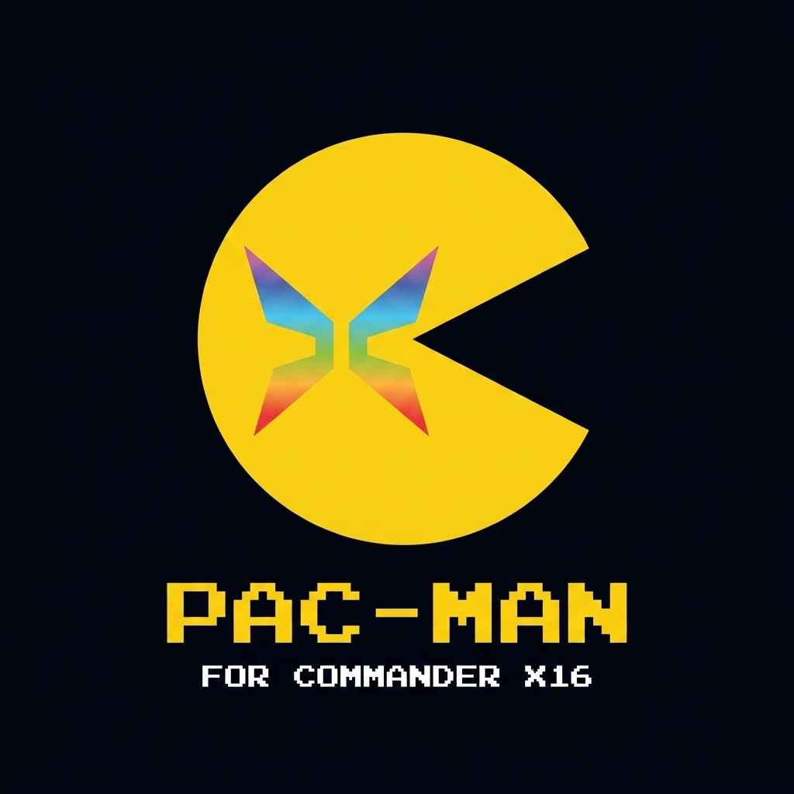

<p align="center"></p>

# Pac-Man for the Commander X16

A faithful port of the 1980 arcade Pac-Man to the
[Commander X16](https://www.commanderx16.com/) — stock 65C02, 512K
banked RAM, no upgrades needed.

This is the **release home**: grab the latest build from the
[Releases page](https://github.com/doomsdayonecom/pac-man/releases),
and read the [wiki](https://github.com/doomsdayonecom/pac-man/wiki)
for loading instructions and gameplay notes.

## Why this port is different

Behaviour is cross-checked frame-by-frame against the genuine Z80
arcade ROM:

- **The attract demo is frame-exact** — all 2,734 frames of it,
  pixel-for-pixel, through to the very frame Inky catches Pac-Man.
- **Movement uses the arcade's own engine** — the ROM's per-level
  speed patterns drive every actor, so ghost behaviour, cornering,
  the ghost-house rhythm and the famous pass-through quirk all match
  the cabinet.
- **The sound is the arcade's sound** — a routine-exact port of the
  ROM's sound driver, verified against the original code running
  under Z80 emulation, played through the real waveform PROM.
- Coffee-break intermissions, two-player alternating play, the pen
  counter system, fruit, Cruise Elroy — all present and measured
  against the original.

## Quick start

Each release carries **two** bundles — pick one: the **standard**
zip for a normal landscape monitor, or the **`-tate`** zip if you
can physically rotate your screen 90° clockwise, which plays the
arcade's true portrait orientation at a pixel-perfect 2× scale.
Identical filenames and instructions either way.

**Real hardware** — copy every file from the release zip to the root
of a FAT32 SD card, then:

```
LOAD"PACMAN.PRG",8,1
RUN
```

**Emulator** — unzip, then from the bundle directory:

```
x16emu -prg PACMAN.PRG -run
```

## Controls

Joystick / SNES pad in port 1, or the keyboard — both always work:

| Action | Controller | Keyboard |
|---|---|---|
| Move Pac-Man | D-pad | WASD or cursor keys |
| Insert a coin | SELECT | C |
| Start one-player (1 credit) | START | V or Enter |
| Start two-player (2 credits) | B | B |
| Pause / resume | — | P |

## Lineage & thanks

This port grew out of the eZ80 assembly **Pac-Man for the Agon
Light 2** begun in 2023 — the X16 version was written against that
codebase as its initial reference, and the arcade art imported from
it is still the basis of every sprite and tile in the game.

Thanks to the Agon community:

- **BeeGee747** — the initial assets on the Agon port, carried over
  to this Commander X16 version.
- **Sijnstra**, **ss7** and **Richard_Turnnidge** — help writing the
  original eZ80 assembly version that served as the reference for
  the initial Commander X16 port.

## Doomsday One

This is a [Doomsday One](http://doomsdayone.com) retro port — the
game's home page is
[doomsdayone.com/games/pac-man](http://doomsdayone.com/games/pac-man).

The game is free, and always will be — but releases reach
[Patreon supporters](https://www.patreon.com/c/doomsdayone) **early**.
Come say hello on the
[Doomsday One Discord](https://discord.gg/P5JhvpKYzV), or jump
straight into the
[Pac-Man Discord](https://discord.gg/4wcYjwnhXe) for this port
specifically.

---

*An unofficial fan port for retro-computing enthusiasts. Pac-Man is a
trademark of Bandai Namco Entertainment Inc. This project is not
affiliated with, or endorsed by, Bandai Namco.*
